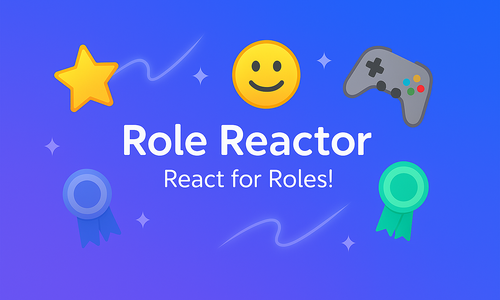

# Role Reactor Bot

<div align="center">
  
</div>

<div align="center">

[](https://nodejs.org/) [](https://discord.js.org/) [](LICENSE) [](https://rolereactor.app/docs)

</div>

---

## 📋 Table of Contents

- [Features](#-features)
- [Quick Start](#-quick-start)
- [Usage](#-usage)
- [Configuration](#-configuration)
- [Troubleshooting](#-troubleshooting)
- [Production Deployment](#-production-deployment)
- [Monitoring](#-monitoring)
- [User Experience](#-user-experience)
- [Documentation](#-documentation)
- [Development Workflow](#-development-workflow)
- [Changelog](#-changelog)
- [Contributing](#-contributing)

A powerful Discord bot that helps you manage your server with role management, AI features, moderation tools, and community engagement features. Perfect for communities of all sizes. Built with Discord.js v14, featuring enterprise-grade logging, health monitoring, and scalable MongoDB integration.

## ✨ Features

- **🎯 Self-Assignable Roles**: Users can assign/remove roles by reacting to messages
- **⏰ Temporary Roles**: Auto-expire roles after a set time with smart notifications
- **📅 Schedule Roles**: Schedule automatic role assignments and removals with one-time or recurring schedules
- **🎉 Welcome System**: Auto-welcome new members with customizable messages and auto-role assignment
- **👋 Goodbye System**: Auto-goodbye messages when members leave with customizable placeholders
- **🧠 Smart 8ball**: Intelligent question analysis with sentiment detection and context-aware responses
- **📊 XP System**: Configurable experience system with level progression and leaderboards
- **🎨 AI Avatar Generation**: AI-powered avatar generation with multiple style options
- **💎 Core Credit System**: Credit-based economy for avatar generation with crypto payment integration
- **📊 Poll System**: Create and manage native Discord polls with interactive forms
- **🛡️ Moderation System**: Comprehensive moderation tools with timeout, warnings, bans, kicks, and history tracking
- **🎙️ Voice Control**: Automatically manage users in voice channels based on roles (disconnect, mute, deafen, move)
- **👤 User Information**: Avatar display, level checking, and user statistics
- **🛡️ Permission Controls**: Comprehensive permission checking
- **🎨 Custom Emojis**: Support for Unicode and custom server emojis
- **📊 Role Categories**: Organize roles into logical groups
- **🔧 Easy Setup**: Simple slash commands for configuration
- **📈 Health Monitoring**: Built-in health checks and performance metrics
- **📝 Structured Logging**: Enterprise-grade logging with file output
- **🎨 User-Friendly UI**: Clean, concise, and helpful messaging with interactive buttons
- **🔗 Centralized Links**: Consistent external links and invite generation

## 🚀 Quick Start

### Prerequisites

- Node.js 16.0.0 or higher
- pnpm package manager
- MongoDB (local or Atlas)
- Discord Bot Token

### Installation

1. **Clone the repository**

   ```bash
   git clone https://github.com/qodinger/role-reactor-bot.git
   cd role-reactor-bot
   ```

2. **Install dependencies**

   ```bash
   pnpm install
   ```

3. **Configure environment variables**

   ```bash
   cp env.example .env
   ```

   Edit `.env` with your configuration:

   ```env
   DISCORD_TOKEN=your_bot_token_here
   DISCORD_CLIENT_ID=your_client_id_here
   MONGODB_URI=mongodb://localhost:27017
   ```

4. **Deploy slash commands**

   ```bash
   # Development (includes developer commands)
   pnpm run deploy:dev

   # Production (excludes developer commands)
   pnpm run deploy:prod
   ```

5. **Start the bot**
   ```bash
   pnpm start
   ```

## 📖 Usage

### Setting Up Role Reactions

Create role-reaction messages using the `/role-reactions setup` command:

**Simple format:**

```
/role-reactions setup title:Choose Your Roles description:React to get roles! roles:🎮:@Gamer, 🎨:@Artist
```

**With categories:**

```
/role-reactions setup title:Game Roles description:Pick your role! roles:🎮:Gamer, 🎨:Artist
```

**Manage existing role-reaction messages:**

```
/role-reactions list
/role-reactions update message_id:1234567890 title:Updated Title
/role-reactions delete message_id:1234567890
```

### Temporary Roles

Assign temporary roles that auto-expire with smart notifications:

**Assign a temporary role:**

```
/temp-roles assign users:@user1,@user2 role:@EventRole duration:2h reason:Tournament participation
```

**Bulk assignment:**

```
/temp-roles assign users:@user1,@user2,@user3 role:@VIP duration:1d reason:Event access
```

**Manage temporary roles:**

```
/temp-roles list
/temp-roles list user:@username
/temp-roles remove users:@username role:@EventRole
```

**Duration formats:**

- `30m` - 30 minutes
- `2h` - 2 hours
- `1d` - 1 day
- `1w` - 1 week

### Schedule Roles

Schedule automatic role assignments and removals with one-time or recurring schedules:

**One-time schedule:**

```
/schedule-role create action:assign role:@EventRole users:@user1,@user2 schedule-type:one-time schedule:"tomorrow 8am"
```

**Recurring schedule:**

```
/schedule-role create action:assign role:@RestrictedRole users:@user1 schedule-type:daily schedule:"9am" reason:"Night shift restriction"
/schedule-role create action:remove role:@RestrictedRole users:@user1 schedule-type:daily schedule:"8am" reason:"Lift restrictions"
```

**Target members by role:**

```
/schedule-role create action:assign role:@PremiumRole users:@VerifiedRole schedule-type:daily schedule:"9am"
```

**Manage schedules:**

```
/schedule-role list page:1
/schedule-role view schedule-id:"abc123-def456-ghi789"
/schedule-role cancel schedule-id:"abc123-def456-ghi789"
```

### Welcome System

Automatically welcome new members with customizable messages and auto-role assignment:

**Setup welcome system:**

```
/welcome setup channel:#welcome message:Welcome {user} to {server}! 🎉 auto-role:@Member enabled:true
```

**View settings:**

```
/welcome settings
```

### Goodbye System

Automatically send goodbye messages when members leave with customizable placeholders:

**Setup goodbye system:**

```
/goodbye setup channel:#general message:**{user}** left the server! Thanks for being part of **{server}**! 👋 enabled:true
```

**View settings:**

```
/goodbye settings
```

**Available placeholders:**

- `{user}` - User mention
- `{user.name}` - Username
- `{user.tag}` - User tag
- `{server}` - Server name
- `{memberCount}` - Member count
- `{memberCount.ordinal}` - Ordinal member count

### XP System Configuration

The XP system is **disabled by default** and must be enabled by server administrators. When enabled, users can earn XP through:

- **Messages**: 15-25 XP every 60 seconds (configurable)
- **Commands**: 8 XP per command every 30 seconds (configurable, applies to all commands)
- **Role Assignments**: 50 XP per role (configurable)
- **Voice Activity**: 10 XP every 60 seconds (configurable)

**Admin Commands:**

- `/xp settings` - View current XP system status and configure features with interactive buttons

**Default Settings:**

- System: Disabled
- Message XP: 15-25 XP (60s cooldown, configurable)
- Command XP: 8 XP per command (30s cooldown, configurable, applies to all commands)
- Role XP: 50 XP per role (configurable)
- Voice XP: 10 XP (60s cooldown, configurable)

**Note:** XP system configuration uses a simplified button-driven interface. All settings use optimized default values that work well for most servers.

### Moderation System

Comprehensive moderation tools with bulk operations and history tracking:

**Timeout users:**

```
/moderation timeout users:@User duration:1h reason:Spam
/moderation timeout users:@User1 @User2 @User3 duration:2h reason:Spam in multiple channels
```

**Warn users:**

```
/moderation warn users:@User reason:Inappropriate behavior
/moderation warn users:@User1 @User2 reason:First warning for inappropriate language
```

**Ban/Kick users:**

```
/moderation ban users:@User reason:Repeated violations delete-days:1
/moderation kick users:@User reason:Temporary removal
/moderation unban users:@User
```

**View moderation history:**

```
/moderation history
/moderation history user:@User
/moderation remove-warn user:@User case-id:MOD-1234567890-ABC123
/moderation list-bans
```

**Purge messages:**

```
/moderation purge amount:50 channel:#general
```

### Voice Control

Automatically manage users in voice channels based on roles:

**Configure voice control roles:**

```
/voice-roles disconnect add role:@Muted
/voice-roles mute add role:@Restricted
/voice-roles deafen add role:@Punished
/voice-roles move add role:@SupportTeam channel:#support-voice
```

**Manage voice control:**

```
/voice-roles list
/voice-roles disconnect remove role:@Muted
/voice-roles mute remove role:@Restricted
```

**How it works:**

- When a user gets a configured role, the bot automatically applies the action (disconnect, mute, deafen, or move)
- Actions are applied when users join voice channels or when roles are assigned
- Actions are automatically applied to users already in voice channels when roles are first configured

### General Commands

**AI Avatar Generation:**

```
/avatar prompt:cyberpunk hacker with neon hair art_style:manga
/avatar prompt:cute girl with pink hair art_style:chibi
```

**Core Credit System:**

```
/core balance
/core pricing
```

**Poll System:**

```
/poll create
/poll list
/poll end poll-id:1234567890
/poll delete poll-id:1234567890
```

**Smart 8ball with intelligent responses:**

```
/8ball question:Will I succeed in my career?
```

**User information and statistics:**

```
/userinfo user:@username
/serverinfo
/level user:@username
/leaderboard
```

**Bot information and support:**

```
/help
/ping
/invite
/support
/sponsor
```

### Available Commands

#### Server Management Commands

| Command                         | Description                                | Permissions   |
| ------------------------------- | ------------------------------------------ | ------------- |
| `/role-reactions setup`         | Create a role-reaction message             | Manage Roles  |
| `/role-reactions list`          | List all role-reaction messages            | Manage Roles  |
| `/role-reactions update`        | Update an existing role-reaction message   | Manage Roles  |
| `/role-reactions delete`        | Delete a role-reaction message             | Manage Roles  |
| `/temp-roles assign`            | Assign temporary roles (supports bulk)     | Manage Roles  |
| `/temp-roles list`              | List temporary roles                       | Manage Roles  |
| `/temp-roles remove`            | Remove temporary roles (supports bulk)     | Manage Roles  |
| `/schedule-role create`         | Schedule role assignments/removals         | Manage Roles  |
| `/schedule-role list`           | List active schedules                      | Manage Roles  |
| `/schedule-role view`           | View schedule details                      | Manage Roles  |
| `/schedule-role cancel`         | Cancel a schedule                          | Manage Roles  |
| `/schedule-role delete`         | Permanently delete a schedule              | Manage Roles  |
| `/welcome setup`                | Configure welcome system                   | Manage Server |
| `/welcome settings`             | View welcome system settings               | Manage Server |
| `/goodbye setup`                | Configure goodbye system                   | Manage Server |
| `/goodbye settings`             | View goodbye system settings               | Manage Server |
| `/xp settings`                  | View and manage XP system settings         | Manage Server |
| `/moderation timeout`           | Timeout users (supports bulk up to 15)     | Administrator |
| `/moderation warn`              | Warn users (supports bulk up to 15)        | Administrator |
| `/moderation ban`               | Ban users (supports bulk up to 15)         | Administrator |
| `/moderation kick`              | Kick users (supports bulk up to 15)        | Administrator |
| `/moderation unban`             | Unban users (supports bulk up to 15)       | Administrator |
| `/moderation purge`             | Delete multiple messages from channel      | Administrator |
| `/moderation history`           | View moderation history                    | Administrator |
| `/moderation remove-warn`       | Remove a warning by case ID                | Administrator |
| `/moderation list-bans`         | List all banned users                      | Administrator |
| `/voice-roles disconnect add` | Add role that disconnects users from voice | Administrator |
| `/voice-roles mute add`       | Add role that mutes users in voice         | Administrator |
| `/voice-roles deafen add`     | Add role that deafens users in voice       | Administrator |
| `/voice-roles move add`       | Add role that moves users to channel       | Administrator |
| `/voice-roles list`           | List all voice control roles               | Administrator |

#### Developer Commands

| Command                                | Description                                      | Permissions |
| -------------------------------------- | ------------------------------------------------ | ----------- |
| `/health`                              | 🔒 [DEVELOPER ONLY] Check bot health status      | Developer   |
| `/performance`                         | 🔒 [DEVELOPER ONLY] View performance metrics     | Developer   |
| `/storage`                             | 🔒 [DEVELOPER ONLY] Show storage status          | Developer   |
| `/core-management`                     | 🔒 [DEVELOPER ONLY] Manage user Core credits     | Developer   |
| `/core-management add`                 | 🔒 [DEVELOPER ONLY] Add bonus Cores to user      | Developer   |
| `/core-management remove`              | 🔒 [DEVELOPER ONLY] Remove bonus Cores from user | Developer   |
| `/core-management set`                 | 🔒 [DEVELOPER ONLY] Set user Core balance        | Developer   |
| `/core-management view`                | 🔒 [DEVELOPER ONLY] View user Core information   | Developer   |
| `/core-management cancel-subscription` | 🔒 [DEVELOPER ONLY] Cancel Core subscription     | Developer   |
| `/imagine`                             | 🔒 [DEVELOPER ONLY] Generate AI artwork          | Developer   |

#### General Commands

| Command         | Description                                     | Permissions |
| --------------- | ----------------------------------------------- | ----------- |
| `/help`         | Display comprehensive bot help and information  | None        |
| `/ping`         | Check bot latency and status                    | None        |
| `/invite`       | Get bot invite link with proper permissions     | None        |
| `/support`      | Get support server and GitHub links             | None        |
| `/8ball`        | Ask the magic 8ball with intelligent responses  | None        |
| `/avatar`       | Generate AI-powered avatars with custom prompts | None        |
| `/core balance` | Check your current Core balance and tier status | None        |
| `/core pricing` | View Core pricing and membership benefits       | None        |
| `/poll create`  | Create a new poll using interactive form        | None        |
| `/poll list`    | List all polls in the server                    | None        |
| `/poll end`     | End an active poll early                        | None        |
| `/poll delete`  | Delete a poll permanently                       | None        |
| `/level`        | Check user XP level and statistics              | None        |
| `/leaderboard`  | View server XP leaderboard                      | None        |
| `/userinfo`     | Display detailed user information               | None        |
| `/serverinfo`   | Display detailed server information             | None        |

## 🔧 Configuration

### Environment Variables

| Variable             | Description                          | Required | Default                     |
| -------------------- | ------------------------------------ | -------- | --------------------------- |
| `DISCORD_TOKEN`      | Discord bot token                    | Yes      | -                           |
| `DISCORD_CLIENT_ID`  | Discord application client ID        | Yes      | -                           |
| `DISCORD_GUILD_ID`   | Target guild ID (for dev)            | No       | -                           |
| `DISCORD_DEVELOPERS` | Developer user IDs (comma-separated) | No       | -                           |
| `MONGODB_URI`        | MongoDB connection URI               | No       | `mongodb://localhost:27017` |
| `MONGODB_DB`         | MongoDB database name                | No       | `role-reactor-bot`          |
| `LOG_LEVEL`          | Log level (ERROR, WARN, INFO, DEBUG) | No       | `INFO`                      |
| `LOG_FILE`           | Log file path                        | No       | Console only                |
| `LOG_CONSOLE`        | Enable console logging               | No       | `true`                      |

### Bot Permissions

Required Discord bot permissions:

- **Manage Roles**: To assign/remove roles and auto-roles
- **Manage Messages**: To add reactions and purge messages
- **Add Reactions**: To add emoji reactions
- **Read Message History**: To access reaction events
- **View Channel**: To read channel content
- **Send Messages**: To send welcome messages
- **Embed Links**: To create rich embeds
- **Attach Files**: To send image attachments (avatar generation, imagine command)
- **Manage Server**: To manage server settings
- **Use External Emojis**: To use emojis from other servers
- **Moderate Members**: To timeout users (for moderation commands)
- **Ban Members**: To ban and unban users (for moderation commands)
- **Kick Members**: To kick users from the server (for moderation commands)
- **Move Members**: To disconnect and move users in voice channels (for voice control and moderation)
- **Mute Members**: To mute users in voice channels (for voice control)
- **Deafen Members**: To deafen users in voice channels (for voice control)

## 🔧 Troubleshooting

### Common Issues

- **Bot not responding**: Check permissions and ensure bot is online
- **Roles not assigning**: Verify bot role is higher than target roles
- **Database errors**: Check MongoDB connection and credentials
- **Command not found**: Ensure slash commands are deployed (`pnpm run deploy:prod`)
- **Avatar generation fails**: Check Core credits balance and AI service status
- **XP not tracking**: Verify XP system is enabled in `/xp settings`

### Performance Issues

- **Slow responses**: Check server resources and database connection
- **Memory usage high**: Monitor with `/performance` command
- **Rate limiting**: Bot automatically handles Discord rate limits

### Getting Help

- Check the [GitHub Issues](https://github.com/qodinger/role-reactor-bot/issues) for known problems
- Join our [Support Server](https://discord.gg/D8tYkU75Ry) for real-time help
- Review the [Deployment Guide](./docs/setup/deployment.md) for setup issues

## 🚀 Production Deployment

### Production Deployment (Docker)

The recommended way to deploy is using the latest automated deployment script:

```bash
# Deploy latest version (pulls, builds, and stays running)
pnpm run deploy:latest

# View logs
pnpm run docker:logs
```

For more options and troubleshooting, see the **[Deployment Guide](./docs/setup/deployment.md)**.

### Developer Setup

To use developer commands (`/health`, `/performance`, `/storage`), configure developers:

1. **Find your Discord User ID** (enable Developer Mode, right-click username, Copy ID)
2. **Add to `.env` file:**
   ```env
   DISCORD_DEVELOPERS=123456789012345678
   ```
3. **Restart the bot**

**Note:** Developer commands are hidden from Discord UI but accessible to authorized developers via runtime permission checks.

## 📊 Monitoring

### Health Checks

The bot includes comprehensive health monitoring:

- **Database connectivity** checks
- **Memory usage** monitoring
- **Performance metrics** tracking
- **Error rate** monitoring
- **Uptime** tracking

### Commands

- `/health` - 🔒 [DEVELOPER ONLY] Check bot health status
- `/performance` - 🔒 [DEVELOPER ONLY] View performance metrics
- `/storage` - 🔒 [DEVELOPER ONLY] Show storage status

## 🎨 User Experience

### Recent Improvements

- **🎨 AI Avatar Generation**: AI-powered avatar creation with multiple style options and content filtering
- **💎 Core Credit System**: Credit-based economy for avatar generation with crypto payment integration
- **📊 Poll System**: Native Discord poll creation and management with interactive forms
- **🛡️ Moderation System**: Comprehensive moderation tools with bulk operations and history tracking
- **🎙️ Voice Control**: Automatic voice channel management based on roles
- **🔄 Bulk Operations**: Multi-user support for temporary role assignments, removals, and moderation
- **🎨 Modern UI**: Redesigned embeds with interactive buttons and better visual hierarchy
- **📝 Enhanced Help**: Comprehensive help system with autocomplete and interactive navigation
- **🔗 Interactive Buttons**: Direct links to support server, GitHub, and sponsor pages
- **⚡ Real-time Updates**: XP settings and other interfaces update in place instead of sending new messages
- **🛡️ Better Error Handling**: Clear, actionable error messages with troubleshooting tips
- **📱 Mobile-Friendly**: Optimized for both desktop and mobile Discord clients

### Command Features

- **Interactive Help**: Dropdown menus, buttons, and autocomplete for easy navigation
- **Smart Responses**: Context-aware 8ball responses based on question analysis
- **Bulk Management**: Multi-user operations for efficient role management
- **AI Avatar Generation**: Custom avatar creation with multiple style options
- **Poll Management**: Interactive poll creation and management with native Discord polls
- **Core Credit System**: Credit-based economy with crypto payment integration
- **Permission Checks**: Automatic permission validation with helpful feedback
- **Error Recovery**: Graceful error handling with retry mechanisms
- **Performance Tips**: Contextual advice based on connection status

## 📖 Documentation

- **[🚀 Deployment Guide](./docs/setup/deployment.md)** - Production deployment instructions
- **[🤝 Contributing Guidelines](./docs/contributing.md)** - How to contribute to the project
- **[🌿 Git Workflow Guide](./docs/development/workflow.md)** - Branch strategy and workflow patterns

## 📝 Changelog

See [changelog.md](./docs/changelog.md) for detailed version history and updates.

## 🤝 Contributing

We welcome contributions! Please see our [Contributing Guidelines](./docs/contributing.md) for detailed information.

### Quick Development Setup

```bash
# Install dependencies
pnpm install

# Start development mode
pnpm dev

# Run linting
pnpm lint

# Run tests
pnpm test
```

## 🔀 Development Workflow

This project follows a structured Git workflow for organized development and collaboration.

### Branch Strategy

- **`main`** - Production-ready, stable code
- **`dev`** - Development integration branch
- **`feature/*`** - Feature development branches
- **`fix/*`** - Bug fix branches
- **`hotfix/*`** - Critical production fixes

### Quick Start

**For small fixes/updates:**

```bash
git checkout main && git pull origin main
# Make changes
git commit -m "fix(scope): description"
git push origin main
```

**For new features:**

```bash
# Using Git helpers (recommended)
source scripts/git-helpers.sh
git-feature feature-name
# ... develop ...
git-finish-feature
```

### Documentation

- **[📘 Git Workflow Guide](./docs/development/workflow.md)** - Complete workflow documentation with patterns and best practices

### Git Helper Scripts

The project includes helper scripts to streamline common Git operations:

```bash
# Source the helpers
source scripts/git-helpers.sh

# Available commands
git-feature <name>          # Create feature branch
git-finish-feature           # Merge feature to dev
git-fix <name>               # Create fix branch
git-finish-fix               # Merge fix to main
git-hotfix <name>            # Create hotfix branch
git-finish-hotfix            # Merge hotfix to main and dev
git-sync-main                # Sync current branch with main
git-sync-dev                 # Sync current branch with dev
git-workflow-help            # Show all available commands
```

See [Git Workflow Guide](./docs/development/workflow.md) for detailed instructions.

## 📄 License

This project is licensed under the MIT License - see the [LICENSE](LICENSE) file for details.
