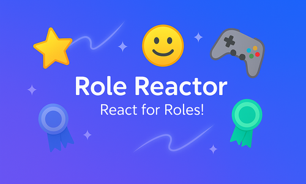

# Role Reactor Bot

<div align="center">
  
</div>

<div align="center">

[](https://nodejs.org/) [](https://discord.js.org/) [](LICENSE) [](https://rolereactor.app/docs)

</div>

---

## 📋 Table of Contents

- [Features](#-features)
- [Quick Start](#-quick-start)
- [Usage](#-usage)
- [Configuration](#-configuration)
- [Troubleshooting](#-troubleshooting)
- [Production Deployment](#-production-deployment)
- [Monitoring](#-monitoring)
- [User Experience](#-user-experience)
- [Documentation](#-documentation)
- [Development Workflow](#-development-workflow)
- [Changelog](#-changelog)
- [Contributing](#-contributing)

A powerful Discord bot that helps you manage your server with role management, AI features, moderation tools, and community engagement features. Perfect for communities of all sizes. Built with Discord.js v14, featuring enterprise-grade logging, health monitoring, and scalable MongoDB integration.

## ✨ Features

- **🎯 Self-Assignable Roles**: Users can assign/remove roles by reacting to messages
- **📦 Role Bundles**: Create reusable groups of roles and use them in role-reaction setups
- **⏰ Temporary Roles**: Auto-expire roles after a set time with smart notifications
- **📅 Schedule Roles**: Schedule automatic role assignments and removals with one-time or recurring schedules
- **🎁 Giveaway System**: Full-featured giveaways with bonus entries, claim periods, requirements, and rerolling
- **🎉 Welcome System**: Auto-welcome new members with customizable messages and auto-role assignment
- **👋 Goodbye System**: Auto-goodbye messages when members leave with customizable placeholders
- **🛡️ Moderation System**: Bulk timeout, warn, ban, kick, purge, and history tracking (up to 15 users at once)
- **🎫 Ticket System**: Complete support ticket system with panels, transcripts, and lifecycle management
- **🎙️ Voice Control**: Automatically manage users in voice channels based on roles (disconnect, mute, deafen, move)
- **📊 XP System**: Configurable experience system with level progression and leaderboards
- **📊 Poll System**: Create and manage native Discord polls with interactive forms
- **💎 Core Credit System**: Credit-based economy with crypto payment integration and Pro Engine upgrades
- **🗳️ Voting Rewards**: Earn Core Credits automatically by voting for the bot on top.gg
- **🎨 AI Avatar Generation**: AI-powered avatar generation with multiple style options
- **🔔 Notification System**: Web dashboard notifications for balance, purchases, and Pro Engine status
- **📈 Health Monitoring**: Built-in health checks and performance metrics
- **📝 Structured Logging**: Enterprise-grade logging with file output

## 🚀 Quick Start

### Prerequisites

- Node.js 16.0.0 or higher
- pnpm package manager
- MongoDB (local or Atlas)
- Discord Bot Token

### Installation

1. **Clone the repository**

   ```bash
   git clone https://github.com/qodinger/role-reactor-bot.git
   cd role-reactor-bot
   ```

2. **Install dependencies**

   ```bash
   pnpm install
   ```

3. **Configure environment variables**

   ```bash
   cp env.example .env
   ```

   Edit `.env` with your configuration:

   ```env
   DISCORD_TOKEN=your_bot_token_here
   DISCORD_CLIENT_ID=your_client_id_here
   MONGODB_URI=mongodb://localhost:27017
   ```

4. **Deploy slash commands**

   ```bash
   # Development (includes developer commands)
   pnpm run deploy:dev

   # Production (excludes developer commands)
   pnpm run deploy:prod
   ```

5. **Start the bot**
   ```bash
   pnpm start
   ```

## 📖 Usage

### Setting Up Role Reactions

Create role-reaction messages using the `/role-reactions setup` command:

**Simple format:**

```
/role-reactions setup title:Choose Your Roles description:React to get roles! roles:🎮:@Gamer, 🎨:@Artist
```

**With categories:**

```
/role-reactions setup title:Game Roles description:Pick your role! roles:🎮:Gamer, 🎨:Artist
```

**Manage existing role-reaction messages:**

```
/role-reactions list
/role-reactions update message_id:1234567890 title:Updated Title
/role-reactions delete message_id:1234567890
```

### Temporary Roles

Assign temporary roles that auto-expire with smart notifications:

**Assign a temporary role:**

```
/temp-roles assign users:@user1,@user2 role:@EventRole duration:2h reason:Tournament participation
```

**Bulk assignment:**

```
/temp-roles assign users:@user1,@user2,@user3 role:@VIP duration:1d reason:Event access
```

**Manage temporary roles:**

```
/temp-roles list
/temp-roles list user:@username
/temp-roles remove users:@username role:@EventRole
```

**Duration formats:**

- `30m` - 30 minutes
- `2h` - 2 hours
- `1d` - 1 day
- `1w` - 1 week

### Schedule Roles

Schedule automatic role assignments and removals with one-time or recurring schedules:

**One-time schedule:**

```
/schedule-role create action:assign role:@EventRole users:@user1,@user2 schedule-type:one-time schedule:"tomorrow 8am"
```

**Recurring schedule:**

```
/schedule-role create action:assign role:@RestrictedRole users:@user1 schedule-type:daily schedule:"9am" reason:"Night shift restriction"
/schedule-role create action:remove role:@RestrictedRole users:@user1 schedule-type:daily schedule:"8am" reason:"Lift restrictions"
```

**Target members by role:**

```
/schedule-role create action:assign role:@PremiumRole users:@VerifiedRole schedule-type:daily schedule:"9am"
```

**Manage schedules:**

```
/schedule-role list page:1
/schedule-role view schedule-id:"abc123-def456-ghi789"
/schedule-role cancel schedule-id:"abc123-def456-ghi789"
```

### Welcome System

Automatically welcome new members with customizable messages and auto-role assignment:

**Setup welcome system:**

```
/welcome setup channel:#welcome message:Welcome {user} to {server}! 🎉 auto-role:@Member enabled:true
```

**View settings:**

```
/welcome settings
```

### Goodbye System

Automatically send goodbye messages when members leave with customizable placeholders:

**Setup goodbye system:**

```
/goodbye setup channel:#general message:**{user}** left the server! Thanks for being part of **{server}**! 👋 enabled:true
```

**View settings:**

```
/goodbye settings
```

**Available placeholders:**

- `{user}` - User mention
- `{user.name}` - Username
- `{user.tag}` - User tag
- `{server}` - Server name
- `{memberCount}` - Member count
- `{memberCount.ordinal}` - Ordinal member count

### XP System Configuration

The XP system is **disabled by default** and must be enabled by server administrators. When enabled, users can earn XP through:

- **Messages**: 15-25 XP every 60 seconds (configurable)
- **Commands**: 8 XP per command every 30 seconds (configurable, applies to all commands)
- **Role Assignments**: 50 XP per role (configurable)
- **Voice Activity**: 10 XP every 60 seconds (configurable)

**Admin Commands:**

- `/xp settings` - View current XP system status and configure features with interactive buttons

**Default Settings:**

- System: Disabled
- Message XP: 15-25 XP (60s cooldown, configurable)
- Command XP: 8 XP per command (30s cooldown, configurable, applies to all commands)
- Role XP: 50 XP per role (configurable)
- Voice XP: 10 XP (60s cooldown, configurable)

**Note:** XP system configuration uses a simplified button-driven interface. All settings use optimized default values that work well for most servers.

### Moderation System

Comprehensive moderation tools with bulk operations and history tracking:

**Timeout users:**

```
/moderation timeout users:@User duration:1h reason:Spam
/moderation timeout users:@User1 @User2 @User3 duration:2h reason:Spam in multiple channels
```

**Warn users:**

```
/moderation warn users:@User reason:Inappropriate behavior
/moderation warn users:@User1 @User2 reason:First warning for inappropriate language
```

**Ban/Kick users:**

```
/moderation ban users:@User reason:Repeated violations delete-days:1
/moderation kick users:@User reason:Temporary removal
/moderation unban users:@User
```

**View moderation history:**

```
/moderation history
/moderation history user:@User
/moderation remove-warn user:@User case-id:MOD-1234567890-ABC123
/moderation list-bans
```

**Purge messages:**

```
/moderation purge amount:50 channel:#general
```

### Voice Control

Automatically manage users in voice channels based on roles:

**Configure voice control roles:**

```
/voice-roles disconnect add role:@Muted
/voice-roles mute add role:@Restricted
/voice-roles deafen add role:@Punished
/voice-roles move add role:@SupportTeam channel:#support-voice
```

**Manage voice control:**

```
/voice-roles list
/voice-roles disconnect remove role:@Muted
/voice-roles mute remove role:@Restricted
```

**How it works:**

- When a user gets a configured role, the bot automatically applies the action (disconnect, mute, deafen, or move)
- Actions are applied when users join voice channels or when roles are assigned
- Actions are automatically applied to users already in voice channels when roles are first configured

### Giveaways

Create and manage server giveaways with requirements and bonus entries:

```
/giveaway create prize:Nitro winners:1 duration:24h
/giveaway create prize:VIP Role winners:3 duration:1w required-role:@Member min-level:5
/giveaway list
/giveaway end giveaway-id:abc123
/giveaway reroll giveaway-id:abc123
/giveaway cancel giveaway-id:abc123
/giveaway edit giveaway-id:abc123 prize:New Prize
/giveaway delete giveaway-id:abc123
```

### Role Bundles

Create reusable groups of roles for role-reaction setups:

```
/role-bundle create name:Starter Roles roles:@Member @Newcomer @Access
/role-bundle list
/role-bundle delete name:Starter Roles
```

Use bundles in role-reaction setup with the `bundle:` parameter.

### General Commands

```
/help                  # Interactive help with clickable command mentions
/ping                  # Check bot latency
/invite                # Get bot invite link
/support               # Support server and GitHub links
/vote                  # Vote on top.gg to earn Core Credits
/core balance          # Check Core balance and Pro Engine status
/core pricing          # View Core pricing
/poll create           # Create a Discord poll
/8ball question:...    # Ask the magic 8ball
/avatar prompt:...     # Generate AI avatar
/userinfo user:@user   # View user details
/serverinfo            # View server details
/level user:@user      # Check XP level
/leaderboard           # View XP leaderboard
```

### Available Commands

#### Server Management Commands

| Command                       | Description                              | Permissions   |
| ----------------------------- | ---------------------------------------- | ------------- |
| `/role-reactions setup`       | Create a role-reaction message           | Manage Roles  |
| `/role-reactions list`        | List all role-reaction messages          | Manage Roles  |
| `/role-reactions update`      | Update an existing role-reaction message | Manage Roles  |
| `/role-reactions delete`      | Delete a role-reaction message           | Manage Roles  |
| `/role-bundle create`         | Create a reusable role bundle            | Manage Roles  |
| `/role-bundle list`           | List all role bundles                    | Manage Roles  |
| `/role-bundle delete`         | Delete a role bundle                     | Manage Roles  |
| `/temp-roles assign`          | Assign temporary roles (supports bulk)   | Manage Roles  |
| `/temp-roles list`            | List temporary roles                     | Manage Roles  |
| `/temp-roles remove`          | Remove temporary roles (supports bulk)   | Manage Roles  |
| `/schedule-role create`       | Schedule role assignments/removals       | Manage Roles  |
| `/schedule-role list`         | List active schedules                    | Manage Roles  |
| `/schedule-role view`         | View schedule details                    | Manage Roles  |
| `/schedule-role cancel`       | Cancel a schedule                        | Manage Roles  |
| `/schedule-role delete`       | Permanently delete a schedule            | Manage Roles  |
| `/giveaway create`            | Create a new giveaway                    | Manage Server |
| `/giveaway list`              | List active giveaways                    | Manage Server |
| `/giveaway end`               | End a giveaway early                     | Manage Server |
| `/giveaway reroll`            | Reroll giveaway winners                  | Manage Server |
| `/giveaway cancel`            | Cancel a giveaway                        | Manage Server |
| `/giveaway edit`              | Edit an active giveaway                  | Manage Server |
| `/giveaway delete`            | Delete a giveaway permanently            | Manage Server |
| `/welcome setup`              | Configure welcome system                 | Manage Server |
| `/welcome settings`           | View welcome system settings             | Manage Server |
| `/goodbye setup`              | Configure goodbye system                 | Manage Server |
| `/goodbye settings`           | View goodbye system settings             | Manage Server |
| `/xp settings`                | View and manage XP system settings       | Manage Server |
| `/moderation timeout`         | Timeout users (supports bulk up to 15)   | Administrator |
| `/moderation warn`            | Warn users (supports bulk up to 15)      | Administrator |
| `/moderation ban`             | Ban users (supports bulk up to 15)       | Administrator |
| `/moderation kick`            | Kick users (supports bulk up to 15)      | Administrator |
| `/moderation unban`           | Unban users (supports bulk up to 15)     | Administrator |
| `/moderation purge`           | Delete multiple messages from channel    | Administrator |
| `/moderation history`         | View moderation history                  | Administrator |
| `/moderation remove-warn`     | Remove a warning by case ID              | Administrator |
| `/moderation list-bans`       | List all banned users                    | Administrator |
| `/voice-roles disconnect add` | Add role that disconnects from voice     | Administrator |
| `/voice-roles mute add`       | Add role that mutes in voice             | Administrator |
| `/voice-roles deafen add`     | Add role that deafens in voice           | Administrator |
| `/voice-roles move add`       | Add role that moves to a channel         | Administrator |
| `/voice-roles list`           | List all voice control roles             | Administrator |
| `/ticket setup`               | Set up ticket support system             | Manage Server |
| `/ticket info`                | View ticket system information           | Manage Server |
| `/ticket panel`               | Manage ticket panels                     | Manage Server |
| `/ticket list`                | List all tickets                         | Manage Server |
| `/ticket view`                | View specific ticket details             | Manage Server |
| `/ticket claim`               | Claim a ticket                           | Manage Server |
| `/ticket close`               | Close a ticket                           | Manage Server |
| `/ticket add`                 | Add user to ticket                       | Manage Server |
| `/ticket remove`              | Remove user from ticket                  | Manage Server |

#### General Commands

| Command         | Description                                      | Permissions |
| --------------- | ------------------------------------------------ | ----------- |
| `/help`         | Interactive help with clickable command mentions | None        |
| `/ping`         | Check bot latency and status                     | None        |
| `/invite`       | Get bot invite link with proper permissions      | None        |
| `/support`      | Get support server and GitHub links              | None        |
| `/8ball`        | Ask the magic 8ball with intelligent responses   | None        |
| `/avatar`       | Generate AI-powered avatars with custom prompts  | None        |
| `/core balance` | Check Core balance and Pro Engine status         | None        |
| `/core pricing` | View Core pricing and membership benefits        | None        |
| `/vote`         | Vote for the bot on top.gg to earn Core Credits  | None        |
| `/poll create`  | Create a new poll using interactive form         | None        |
| `/poll list`    | List all polls in the server                     | None        |
| `/poll end`     | End an active poll early                         | None        |
| `/poll delete`  | Delete a poll permanently                        | None        |
| `/level`        | Check user XP level and statistics               | None        |
| `/leaderboard`  | View server XP leaderboard                       | None        |
| `/userinfo`     | Display detailed user information                | None        |
| `/serverinfo`   | Display detailed server information              | None        |

## 🔧 Configuration

### Environment Variables

| Variable             | Description                          | Required | Default                     |
| -------------------- | ------------------------------------ | -------- | --------------------------- |
| `DISCORD_TOKEN`      | Discord bot token                    | Yes      | -                           |
| `DISCORD_CLIENT_ID`  | Discord application client ID        | Yes      | -                           |
| `DISCORD_GUILD_ID`   | Target guild ID (for dev)            | No       | -                           |
| `DISCORD_DEVELOPERS` | Developer user IDs (comma-separated) | No       | -                           |
| `MONGODB_URI`        | MongoDB connection URI               | No       | `mongodb://localhost:27017` |
| `MONGODB_DB`         | MongoDB database name                | No       | `role-reactor-bot`          |
| `LOG_LEVEL`          | Log level (ERROR, WARN, INFO, DEBUG) | No       | `INFO`                      |
| `LOG_FILE`           | Log file path                        | No       | Console only                |
| `LOG_CONSOLE`        | Enable console logging               | No       | `true`                      |

### Bot Permissions

Required Discord bot permissions:

- **Manage Roles**: To assign/remove roles and auto-roles
- **Manage Messages**: To add reactions and purge messages
- **Add Reactions**: To add emoji reactions
- **Read Message History**: To access reaction events
- **View Channel**: To read channel content
- **Send Messages**: To send welcome messages
- **Embed Links**: To create rich embeds
- **Attach Files**: To send image attachments (avatar generation, imagine command)
- **Manage Server**: To manage server settings
- **Use External Emojis**: To use emojis from other servers
- **Moderate Members**: To timeout users (for moderation commands)
- **Ban Members**: To ban and unban users (for moderation commands)
- **Kick Members**: To kick users from the server (for moderation commands)
- **Move Members**: To disconnect and move users in voice channels (for voice control and moderation)
- **Mute Members**: To mute users in voice channels (for voice control)
- **Deafen Members**: To deafen users in voice channels (for voice control)

## 🔧 Troubleshooting

### Common Issues

- **Bot not responding**: Check permissions and ensure bot is online
- **Roles not assigning**: Verify bot role is higher than target roles
- **Database errors**: Check MongoDB connection and credentials
- **Command not found**: Ensure slash commands are deployed (`pnpm run deploy:prod`)
- **Avatar generation fails**: Check Core credits balance and AI service status
- **XP not tracking**: Verify XP system is enabled in `/xp settings`

### Performance Issues

- **Slow responses**: Check server resources and database connection
- **Memory usage high**: Check Docker/container resource limits and bot logs
- **Rate limiting**: Bot automatically handles Discord rate limits

### Getting Help

- Check the [GitHub Issues](https://github.com/qodinger/role-reactor-bot/issues) for known problems
- Join our [Support Server](https://discord.gg/D8tYkU75Ry) for real-time help
- Review the [Deployment Guide](./docs/setup/deployment.md) for setup issues

## 🚀 Production Deployment

### Production Deployment (Docker)

The recommended way to deploy is using the latest automated deployment script:

```bash
# Deploy latest version (pulls, builds, and stays running)
pnpm run deploy:latest

# View logs
pnpm run docker:logs
```

For more options and troubleshooting, see the **[Deployment Guide](./docs/setup/deployment.md)**.

### Developer Configuration

To enable developer-only features (hidden commands and debug logging), configure developer IDs:

1. **Find your Discord User ID** (enable Developer Mode in Discord, right-click your username, Copy ID)
2. **Add to `.env` file:**
   ```env
   DISCORD_DEVELOPERS=123456789012345678
   ```
3. **Restart the bot**

**Note:** Developer features are hidden from the Discord UI and only accessible to authorized users via runtime permission checks.

## 📊 Monitoring

### Health Checks

The bot includes comprehensive health monitoring:

- **Database connectivity** checks
- **Memory usage** monitoring
- **Performance metrics** tracking
- **Error rate** monitoring
- **Uptime** tracking

**Note:** Bot health and performance monitoring is handled automatically. Developers can access detailed metrics through bot logs and the unified API server.

## 💎 Pro Engine

Upgrade your server with the **Pro Engine** for enhanced limits and features:

| Feature            | Free Tier  | Pro Engine ✨   |
| :----------------- | :--------- | :-------------- |
| Giveaway Entries   | 2,500      | **50,000**      |
| Giveaway Winners   | 5          | **20**          |
| Scheduled Roles    | 25 active  | **500 active**  |
| Ticket Capacity    | 50 monthly | **500 monthly** |
| Transcript Storage | 7 Days     | **Unlimited**   |
| Bulk Actions       | 25 users   | **250 users**   |
| Level Rewards      | 5 (Stack)  | **Unlimited**   |

See [Core Energy Guide](./docs/CORE_ENERGY.md) for details on activation and pricing.

## 📖 Documentation

- **[🚀 Deployment Guide](./docs/setup/deployment.md)** - Production deployment instructions
- **[💎 Core Energy & Pro Engine](./docs/CORE_ENERGY.md)** - Credits, voting, and Pro Engine guide
- **[🗳️ top.gg Voting Setup](./docs/integrations/topgg.md)** - Voting rewards webhook integration
- **[🤝 Contributing Guidelines](./docs/CONTRIBUTING.md)** - How to contribute to the project
- **[🌿 Git Workflow Guide](./docs/development/workflow.md)** - Branch strategy and workflow patterns

## 📝 Changelog

See [CHANGELOG.md](./docs/CHANGELOG.md) for detailed version history and updates.

## 🤝 Contributing

We welcome contributions! Please see our [Contributing Guidelines](./docs/CONTRIBUTING.md) for detailed information.

### Quick Development Setup

```bash
# Install dependencies
pnpm install

# Start development mode
pnpm dev

# Run linting
pnpm lint

# Run tests
pnpm test
```

## 🔀 Development Workflow

This project follows a structured Git workflow for organized development and collaboration.

### Branch Strategy

- **`main`** - Production-ready, stable code
- **`dev`** - Development integration branch
- **`feature/*`** - Feature development branches
- **`fix/*`** - Bug fix branches
- **`hotfix/*`** - Critical production fixes

### Quick Start

**For small fixes/updates:**

```bash
git checkout main && git pull origin main
# Make changes
git commit -m "fix(scope): description"
git push origin main
```

**For new features:**

```bash
# Using Git helpers (recommended)
source scripts/git-helpers.sh
git-feature feature-name
# ... develop ...
git-finish-feature
```

### Documentation

- **[📘 Git Workflow Guide](./docs/development/workflow.md)** - Complete workflow documentation with patterns and best practices

### Git Helper Scripts

The project includes helper scripts to streamline common Git operations:

```bash
# Source the helpers
source scripts/git-helpers.sh

# Available commands
git-feature <name>          # Create feature branch
git-finish-feature           # Merge feature to dev
git-fix <name>               # Create fix branch
git-finish-fix               # Merge fix to main
git-hotfix <name>            # Create hotfix branch
git-finish-hotfix            # Merge hotfix to main and dev
git-sync-main                # Sync current branch with main
git-sync-dev                 # Sync current branch with dev
git-workflow-help            # Show all available commands
```

See [Git Workflow Guide](./docs/development/workflow.md) for detailed instructions.

## 📄 License

This project is licensed under the MIT License - see the [LICENSE](LICENSE) file for details.
