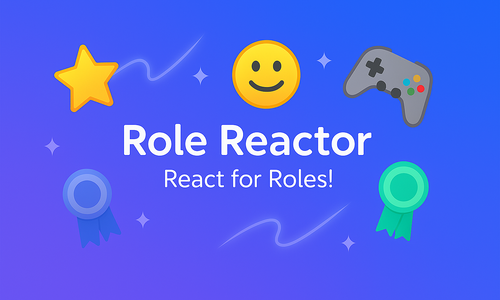

# Role Reactor Bot

<div align="center">
  
</div>

<div align="center">

[](https://nodejs.org/) [](https://discord.js.org/) [](LICENSE) [](https://rolereactor.app/docs)

</div>

---

## 📋 Table of Contents

- [Features](#-features)
- [Quick Start](#-quick-start)
- [Configuration](#-configuration)
- [Troubleshooting](#-troubleshooting)
- [Production Deployment](#-production-deployment)
- [Monitoring](#-monitoring)
- [Documentation](#-documentation)
- [Development Workflow](#-development-workflow)
- [Changelog](#-changelog)
- [Contributing](#-contributing)

A powerful Discord bot that helps you manage your server with role management, AI features, moderation tools, and community engagement features. Perfect for communities of all sizes. Built with Discord.js v14, featuring enterprise-grade logging, health monitoring, and scalable MongoDB integration.

## ✨ Features

- **🎯 Self-Assignable Roles**: Users can assign/remove roles by reacting to messages
- **📦 Role Bundles**: Create reusable groups of roles and use them in role-reaction setups
- **⏰ Temporary Roles**: Auto-expire roles after a set time with smart notifications
- **📅 Schedule Roles**: Schedule automatic role assignments and removals with one-time or recurring schedules
- **🎁 Giveaway System**: Full-featured giveaways with bonus entries, claim periods, requirements, and rerolling
- **🎉 Welcome System**: Auto-welcome new members with customizable messages and auto-role assignment
- **👋 Goodbye System**: Auto-goodbye messages when members leave with customizable placeholders
- **🛡️ Auto-Mod System**: Automatic content filtering with bad words, links, spam, mention spam, and invite link filters
- **🛡️ Moderation System**: Bulk timeout, warn, ban, kick, purge, and history tracking (up to 15 users at once)
- **🎫 Ticket System**: Complete support ticket system with panels, transcripts, and lifecycle management
- **🎙️ Voice Control**: Automatically manage users in voice channels based on roles (disconnect, mute, deafen, move)
- **📊 XP System**: Configurable experience system with level progression and leaderboards
- **📊 Poll System**: Create and manage native Discord polls with interactive forms
- **💎 Core Credit System**: Credit-based economy with crypto payment integration and Pro Engine upgrades
- **🗳️ Voting Rewards**: Earn Core Credits automatically by voting for the bot on top.gg
- **🎨 AI Avatar Generation**: AI-powered avatar generation with multiple style options
- **🔔 Notification System**: Web dashboard notifications for balance, purchases, and Pro Engine status
- **📈 Health Monitoring**: Built-in health checks and performance metrics
- **📝 Structured Logging**: Enterprise-grade logging with file output

## 🚀 Quick Start

### Prerequisites

- Node.js 20.0.0 or higher
- pnpm package manager
- MongoDB (local or Atlas)
- Discord Bot Token

### Installation

1. **Clone the repository**

   ```bash
   git clone https://github.com/qodinger/role-reactor-bot.git
   cd role-reactor-bot
   ```

2. **Install dependencies**

   ```bash
   pnpm install
   ```

3. **Configure environment variables**

   ```bash
   cp env.example .env
   ```

   Edit `.env` with your configuration:

   ```env
   DISCORD_TOKEN=your_bot_token_here
   DISCORD_CLIENT_ID=your_client_id_here
   MONGODB_URI=mongodb://localhost:27017
   ```

4. **Deploy slash commands**

   ```bash
   # Development (includes developer commands)
   pnpm run deploy:dev

   # Production (excludes developer commands)
   pnpm run deploy:prod
   ```

5. **Start the bot**
   ```bash
   pnpm start
   ```

## 🔧 Configuration

### Environment Variables

| Variable             | Description                          | Required | Default                     |
| -------------------- | ------------------------------------ | -------- | --------------------------- |
| `DISCORD_TOKEN`      | Discord bot token                    | Yes      | -                           |
| `DISCORD_CLIENT_ID`  | Discord application client ID        | Yes      | -                           |
| `DISCORD_GUILD_ID`   | Target guild ID (for dev)            | No       | -                           |
| `DISCORD_DEVELOPERS` | Developer user IDs (comma-separated) | No       | -                           |
| `MONGODB_URI`        | MongoDB connection URI               | No       | `mongodb://localhost:27017` |
| `MONGODB_DB`         | MongoDB database name                | No       | `role-reactor-bot`          |
| `LOG_LEVEL`          | Log level (ERROR, WARN, INFO, DEBUG) | No       | `INFO`                      |
| `LOG_FILE`           | Log file path                        | No       | Console only                |
| `LOG_CONSOLE`        | Enable console logging               | No       | `true`                      |

### Bot Permissions

Required Discord bot permissions:

- **Manage Roles**: To assign/remove roles and auto-roles
- **Manage Messages**: To add reactions and purge messages
- **Add Reactions**: To add emoji reactions
- **Read Message History**: To access reaction events
- **View Channel**: To read channel content
- **Send Messages**: To send welcome messages
- **Embed Links**: To create rich embeds
- **Attach Files**: To send image attachments (avatar generation, imagine command)
- **Manage Server**: To manage server settings
- **Use External Emojis**: To use emojis from other servers
- **Moderate Members**: To timeout users (for moderation commands)
- **Ban Members**: To ban and unban users (for moderation commands)
- **Kick Members**: To kick users from the server (for moderation commands)
- **Move Members**: To disconnect and move users in voice channels (for voice control and moderation)
- **Mute Members**: To mute users in voice channels (for voice control)
- **Deafen Members**: To deafen users in voice channels (for voice control)

## 🔧 Troubleshooting

### Common Issues

- **Bot not responding**: Check permissions and ensure bot is online
- **Roles not assigning**: Verify bot role is higher than target roles
- **Database errors**: Check MongoDB connection and credentials
- **Command not found**: Ensure slash commands are deployed (`pnpm run deploy:prod`)
- **Avatar generation fails**: Check Core credits balance and AI service status
- **XP not tracking**: Verify XP system is enabled in `/xp settings`

### Performance Issues

- **Slow responses**: Check server resources and database connection
- **Memory usage high**: Check Docker/container resource limits and bot logs
- **Rate limiting**: Bot automatically handles Discord rate limits

### Getting Help

- Check the [GitHub Issues](https://github.com/qodinger/role-reactor-bot/issues) for known problems
- Join our [Support Server](https://discord.gg/D8tYkU75Ry) for real-time help
- Review the [Deployment Guide](./docs/setup/deployment.md) for setup issues

## 🚀 Production Deployment

### Architecture

Production runs on a VPS with Caddy handling SSL and domain routing automatically:

```
Internet → Caddy (SSL + api.rolereactor.app) → Docker container:3030
```

### Deploy

```bash
# Deploy latest version (pulls, builds, and starts)
pnpm run deploy:latest

# View logs
pnpm run docker:logs
```

For the full setup including DNS, firewall, and Caddy configuration, see the **[Deployment Guide](./docs/setup/deployment.md)**.

### Developer Configuration

To enable developer-only features (hidden commands and debug logging), configure developer IDs:

1. **Find your Discord User ID** (enable Developer Mode in Discord, right-click your username, Copy ID)
2. **Add to `.env` file:**
   ```env
   DISCORD_DEVELOPERS=123456789012345678
   ```
3. **Restart the bot**

**Note:** Developer features are hidden from the Discord UI and only accessible to authorized users via runtime permission checks.

## 📊 Monitoring

### Health Checks

The bot includes comprehensive health monitoring:

- **Database connectivity** checks
- **Memory usage** monitoring
- **Performance metrics** tracking
- **Error rate** monitoring
- **Uptime** tracking

**Note:** Bot health and performance monitoring is handled automatically. Developers can access detailed metrics through bot logs and the unified API server.

## 💎 Pro Engine

Upgrade your server with the **Pro Engine** for enhanced limits and features:

| Feature            | Free Tier          | Pro Engine ✨           |
| :----------------- | :----------------- | :---------------------- |
| Giveaway Entries   | 2,500              | **50,000**              |
| Giveaway Winners   | 5                  | **20**                  |
| Giveaway Active    | 3                  | **20**                  |
| Scheduled Roles    | 25 active          | **500 active**          |
| Temp Roles         | 25 active          | **500 active**          |
| Temp Roles Bulk    | 25 users           | **250 users**           |
| Role Bundles       | 5 roles            | **15 roles**            |
| Role Reactions     | 10 emojis, 3 menus | **20 emojis, 8 menus** |
| XP Rewards         | 5 (Stack)          | **Unlimited**           |
| Ticket Transcripts | Text               | **HTML/JSON**           |
| Auto-Mod Filters   | 5                  | **7 advanced**          |

### Auto-Mod Pro Features:

- Domain Allowlisting (whitelist trusted domains)
- Caps Lock Filter (block ALL CAPS messages)
- Wildcard/Regex (advanced pattern matching)
- Per-Channel Filtering
- Analytics & Statistics
- Export Moderation Logs

See [Core Energy Guide](./docs/CORE_ENERGY.md) for details on activation and pricing.

## 📖 Documentation

- **[📘 Command Reference](https://rolereactor.app/docs)** - Full command usage and examples
- **[🚀 Deployment Guide](./docs/setup/deployment.md)** - Production deployment instructions
- **[💎 Core Energy & Pro Engine](./docs/CORE_ENERGY.md)** - Credits, voting, and Pro Engine guide
- **[🗳️ top.gg Voting Setup](./docs/integrations/topgg.md)** - Voting rewards webhook integration
- **[🤝 Contributing Guidelines](./docs/CONTRIBUTING.md)** - How to contribute to the project
- **[🌿 Git Workflow Guide](./docs/development/workflow.md)** - Branch strategy and workflow patterns

## 📝 Changelog

See [CHANGELOG.md](./docs/CHANGELOG.md) for detailed version history and updates.

## 🤝 Contributing

We welcome contributions! Please see our [Contributing Guidelines](./docs/CONTRIBUTING.md) for detailed information. All contributors must adhere to our [Code of Conduct](CODE_OF_CONDUCT.md).

### Quick Development Setup

```bash
# Install dependencies
pnpm install

# Start development mode
pnpm dev

# Run linting
pnpm lint

# Run tests
pnpm test
```

## 🔀 Development Workflow

This project follows a structured Git workflow for organized development and collaboration.

### Branch Strategy

- **`main`** - Production-ready, stable code
- **`dev`** - Development integration branch
- **`feature/*`** - Feature development branches
- **`fix/*`** - Bug fix branches
- **`hotfix/*`** - Critical production fixes

### Quick Start

**For small fixes/updates:**

```bash
git checkout main && git pull origin main
# Make changes
git commit -m "fix(scope): description"
git push origin main
```

**For new features:**

```bash
# Using Git helpers (recommended)
source scripts/git-helpers.sh
git-feature feature-name
# ... develop ...
git-finish-feature
```

### Documentation

- **[📘 Git Workflow Guide](./docs/development/workflow.md)** - Complete workflow documentation with patterns and best practices

### Git Helper Scripts

The project includes helper scripts to streamline common Git operations:

```bash
# Source the helpers
source scripts/git-helpers.sh

# Available commands
git-feature <name>          # Create feature branch
git-finish-feature           # Merge feature to dev
git-fix <name>               # Create fix branch
git-finish-fix               # Merge fix to main
git-hotfix <name>            # Create hotfix branch
git-finish-hotfix            # Merge hotfix to main and dev
git-sync-main                # Sync current branch with main
git-sync-dev                 # Sync current branch with dev
git-workflow-help            # Show all available commands
```

See [Git Workflow Guide](./docs/development/workflow.md) for detailed instructions.

## 🔒 Security

This bot implements enterprise-grade security measures to protect your community:

- **🛡️ Multi-Layer Authentication** - Discord OAuth + API key + guild permission verification
- **🔐 Authorization Checks** - Users must have ManageRoles permission to manage role reactions
- **⏱️ Rate Limiting** - Prevents abuse of sensitive endpoints (10 requests/15min for role management)
- **📝 Audit Logging** - All API requests logged with user context for security monitoring
- **🚫 Input Validation** - Strict validation on all API inputs to prevent injection attacks

### Security Vulnerability Disclosure

In April 2026, a critical security vulnerability was discovered and immediately fixed:

- **Issue**: API endpoints could be exploited to assign unauthorized roles
- **Fix**: Implemented multi-layer authentication and authorization
- **Status**: ✅ Fixed in version 1.7.0+

To report a security issue, please contact us privately before public disclosure.

## 📄 License

This project is licensed under the MIT License - see the [LICENSE](LICENSE) file for details.
