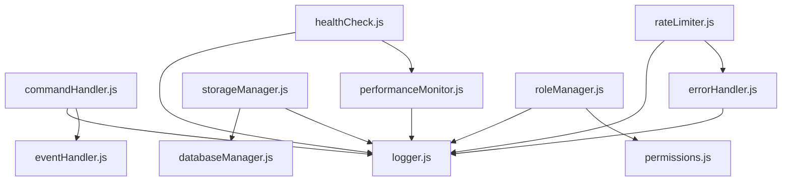

# Utils Directory Documentation

This directory contains all utility modules for the Role Reactor Bot, providing core functionality for command handling, error management, storage, and system monitoring.

## 📁 Directory Structure

```
src/utils/
├── README.md                    # This documentation file
├── commandHandler.js            # Command registration and execution
├── databaseManager.js           # MongoDB connection and operations
├── errorHandler.js              # Centralized error handling
├── eventHandler.js              # Event processing and management
├── healthCheck.js               # System health monitoring
├── healthServer.js              # HTTP health check server
├── logger.js                    # Structured logging system
├── performanceMonitor.js        # Performance metrics and monitoring
├── permissions.js               # Permission validation utilities
├── rateLimiter.js               # Rate limiting implementation
├── roleManager.js               # Role assignment and management
├── roleMessageOptions.js        # Role message configuration
├── scheduler.js                 # Task scheduling and cleanup
├── security.js                  # Security and validation utilities
├── storageManager.js            # Hybrid storage system
├── temporaryRoles.js            # Temporary role management
├── terminal.js                  # Terminal UI and display
├── validation.js                # Input validation utilities
└── version.js                   # Version management and updates
```

## 🏗️ Architecture Overview

The utils directory follows a modular architecture where each module has a specific responsibility:

### **Core System Modules**

- **commandHandler.js** - Manages all command operations
- **eventHandler.js** - Handles Discord event processing
- **errorHandler.js** - Centralized error management
- **logger.js** - Structured logging system

### **Storage & Data Modules**

- **databaseManager.js** - MongoDB operations
- **storageManager.js** - Hybrid storage system (MongoDB + local files)
- **temporaryRoles.js** - Temporary role management

### **Performance & Monitoring**

- **performanceMonitor.js** - System performance tracking
- **healthCheck.js** - Health monitoring
- **healthServer.js** - HTTP health endpoints

### **Security & Validation**

- **security.js** - Security utilities
- **validation.js** - Input validation
- **permissions.js** - Permission checking
- **rateLimiter.js** - Rate limiting

### **Role Management**

- **roleManager.js** - Role assignment logic
- **roleMessageOptions.js** - Role message configuration
- **scheduler.js** - Task scheduling

### **UI & Utilities**

- **terminal.js** - Terminal interface
- **version.js** - Version management

## 🔧 Module Dependencies



## 📋 Module Documentation

### **commandHandler.js**

Handles all command-related operations including registration, execution, caching, and statistics.

**Key Features:**

- Command registration and validation
- Permission caching for performance
- Command execution with error handling
- Usage statistics tracking
- Automatic cache cleanup

**Usage:**

```javascript
import { getCommandHandler } from "./utils/commandHandler.js";

const handler = getCommandHandler();
handler.registerCommand(myCommand);
await handler.executeCommand(interaction, client);
```

### **errorHandler.js**

Provides comprehensive error handling for all types of errors that can occur in a Discord bot.

**Key Features:**

- Discord API error handling
- Database error management
- Command execution error handling
- User-friendly error messages
- Retry mechanism for transient errors

**Usage:**

```javascript
import { errorHandler } from "./utils/errorHandler.js";

try {
  await interaction.reply("Hello!");
} catch (error) {
  errorHandler.handleDiscordError(error, "reply to interaction");
}
```

### **storageManager.js**

Manages the hybrid storage system that combines MongoDB with local file backup.

**Key Features:**

- Automatic fallback to local files
- Data synchronization between storage methods
- Caching for performance
- Graceful error handling

**Usage:**

```javascript
import { getStorageManager } from "./utils/storageManager.js";

const storage = await getStorageManager();
const mappings = await storage.getRoleMappings();
```

### **performanceMonitor.js**

Tracks system performance metrics for monitoring and optimization.

**Key Features:**

- Memory usage monitoring
- Command execution timing
- Database query tracking
- Performance trend analysis

**Usage:**

```javascript
import { getPerformanceMonitor } from "./utils/performanceMonitor.js";

const monitor = getPerformanceMonitor();
const summary = monitor.getPerformanceSummary();
```

## 🚀 Best Practices

### **Error Handling**

- Always use the centralized error handler
- Provide context for better debugging
- Use user-friendly error messages
- Implement retry logic for transient errors

### **Performance**

- Use caching for frequently accessed data
- Monitor performance metrics
- Clean up resources properly
- Implement rate limiting

### **Security**

- Validate all user input
- Check permissions before operations
- Use environment variables for secrets
- Implement proper error handling

### **Logging**

- Use structured logging
- Include relevant context
- Log at appropriate levels
- Monitor log output

## 🔍 Debugging

### **Common Issues**

1. **Permission Errors** - Check bot permissions and user roles
2. **Database Connection** - Verify MongoDB connection string
3. **Rate Limiting** - Monitor rate limit usage
4. **Memory Issues** - Check performance metrics

### **Debugging Tools**

- `/health` command for system status
- `/performance` command for metrics
- `/storage` command for storage status
- Health server endpoints

## 📈 Monitoring

### **Key Metrics**

- Command execution times
- Memory usage trends
- Database query performance
- Error rates and types
- Rate limit usage

### **Health Checks**

- Database connectivity
- Discord API status
- Storage system health
- Performance thresholds

## 🔄 Maintenance

### **Regular Tasks**

- Clean up expired cache entries
- Monitor performance metrics
- Check error logs
- Update rate limit settings
- Verify storage integrity

### **Updates**

- Keep dependencies updated
- Monitor Discord API changes
- Update error handling as needed
- Optimize performance bottlenecks

## 📚 Additional Resources

- [Discord.js Documentation](https://discord.js.org/)
- [MongoDB Node.js Driver](https://docs.mongodb.com/drivers/node/)
- [Node.js Best Practices](https://github.com/goldbergyoni/nodebestpractices)

---

_This documentation is maintained as part of the Role Reactor Bot project. For questions or contributions, please refer to the main project documentation._
