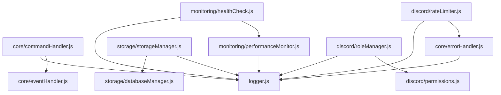

# Utils Directory Documentation

This directory contains all utility modules for the Role Reactor Bot, providing core functionality for command handling, error management, storage, and system monitoring.

## 📁 Directory Structure

```
src/utils/
├── README.md                    # This documentation file
├── core/
│   ├── commandHandler.js
│   ├── eventHandler.js
│   └── errorHandler.js
├── discord/
│   ├── invite.js
│   ├── permissions.js
│   ├── rateLimiter.js
│   ├── responseMessages.js
│   ├── roleManager.js
│   ├── roleMessageOptions.js
│   ├── security.js
│   ├── temporaryRoles.js
│   ├── validation.js
│   └── version.js
├── monitoring/
│   ├── healthCheck.js
│   ├── healthServer.js
│   └── performanceMonitor.js
├── storage/
│   ├── databaseManager.js
│   └── storageManager.js
├── logger.js                    # Generic logger
├── scheduler.js                 # Generic task scheduler
└── terminal.js                  # Generic terminal utilities
```

## 🏗️ Architecture Overview

The utils directory follows a modular architecture where each module has a specific responsibility:

### **Core System Modules**

- **core/** - Manages all command operations, event processing, and error handling.

### **Storage & Data Modules**

- **storage/** - Handles MongoDB operations and the hybrid storage system.
- **discord/temporaryRoles.js** - Manages temporary roles.

### **Performance & Monitoring**

- **monitoring/** - Health and performance monitoring.

### **Security & Validation**

- **discord/security.js** - Security utilities
- **discord/validation.js** - Input validation
- **discord/permissions.js** - Permission checking
- **discord/rateLimiter.js** - Rate limiting

### **Role Management**

- **discord/roleManager.js** - Role assignment logic
- **discord/roleMessageOptions.js** - Role message configuration
- **scheduler.js** - Task scheduling

### **UI & Utilities**

- **terminal.js** - Terminal interface
- **discord/version.js** - Version management
- **discord/responseMessages.js** - Reusable response embeds

## 🔧 Module Dependencies



## 📋 Module Documentation

### **core/commandHandler.js**

Handles all command-related operations including registration, execution, caching, and statistics.

**Usage:**

```javascript
import { getCommandHandler } from "./utils/core/commandHandler.js";

const handler = getCommandHandler();
handler.registerCommand(myCommand);
await handler.executeCommand(interaction, client);
```

### **core/errorHandler.js**

Provides comprehensive error handling for all types of errors that can occur in a Discord bot.

**Usage:**

```javascript
import { errorHandler } from "./utils/core/errorHandler.js";

try {
  await interaction.reply("Hello!");
} catch (error) {
  errorHandler.handleDiscordError(error, "reply to interaction");
}
```

### **storage/storageManager.js**

Manages the hybrid storage system that combines MongoDB with local file backup.

**Usage:**

```javascript
import { getStorageManager } from "./utils/storage/storageManager.js";

const storage = await getStorageManager();
const mappings = await storage.getRoleMappings();
```

### **monitoring/performanceMonitor.js**

- **Description:** System performance tracking
- **Dependencies:** `logger.js`
- **Example Usage:**
  ```javascript
  import { getPerformanceMonitor } from "./utils/monitoring/performanceMonitor.js";
  const monitor = getPerformanceMonitor();
  monitor.trackCommand("ping", 50);
  ```

### **monitoring/healthCheck.js**

Provides comprehensive health monitoring for the bot.

**Key Features:**

- Discord API status monitoring
- Database connectivity checks
- Performance threshold alerts
- Detailed error reporting

**Usage:**

```javascript
import { getHealthCheck } from "./utils/monitoring/healthCheck.js";

const health = getHealthCheck();
health.startMonitoring();
```

## 🚀 Best Practices

### **Error Handling**

- Always use the centralized error handler
- Provide context for better debugging
- Use user-friendly error messages
- Implement retry logic for transient errors

### **Performance**

- Use caching for frequently accessed data
- Monitor performance metrics
- Clean up resources properly
- Implement rate limiting

### **Security**

- Validate all user input
- Check permissions before operations
- Use environment variables for secrets
- Implement proper error handling

### **Logging**

- Use structured logging
- Include relevant context
- Log at appropriate levels
- Monitor log output

## 🔍 Debugging

### **Common Issues**

1. **Permission Errors** - Check bot permissions and user roles
2. **Database Connection** - Verify MongoDB connection string
3. **Rate Limiting** - Monitor rate limit usage
4. **Memory Issues** - Check performance metrics

### **Debugging Tools**

- `/health` command for system status
- `/performance` command for metrics
- `/storage` command for storage status
- Health server endpoints

## 📈 Monitoring

### **Key Metrics**

- Command execution times
- Memory usage trends
- Database query performance
- Error rates and types
- Rate limit usage

### **Health Checks**

- Database connectivity
- Discord API status
- Storage system health
- Performance thresholds

## 🔄 Maintenance

### **Regular Tasks**

- Clean up expired cache entries
- Monitor performance metrics
- Check error logs
- Update rate limit settings
- Verify storage integrity

### **Updates**

- Keep dependencies updated
- Monitor Discord API changes
- Update error handling as needed
- Optimize performance bottlenecks

## 📚 Additional Resources

- [Discord.js Documentation](https://discord.js.org/)
- [MongoDB Node.js Driver](https://docs.mongodb.com/drivers/node/)
- [Node.js Best Practices](https://github.com/goldbergyoni/nodebestpractices)

---

_This documentation is maintained as part of the Role Reactor Bot project. For questions or contributions, please refer to the main project documentation._
