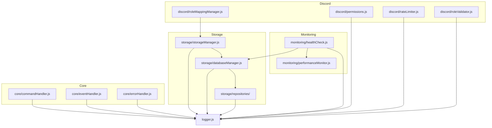

# Utils Directory Documentation

This directory contains all utility modules for the Role Reactor Bot, providing core functionality for command handling, error management, storage, and system monitoring.

## 📁 Directory Structure

```
src/utils/
├── README.md
├── ai/                          # AI utilities (see ai/README.md)
│   ├── actionExecutor.js
│   ├── actionRegistry.js
│   ├── aiCreditManager.js
│   ├── avatarService.js
│   ├── chatService.js
│   ├── commandDiscoverer.js
│   ├── commandExecutor/
│   ├── commandExecutor.js
│   ├── commandSuggester.js
│   ├── concurrencyManager.js
│   ├── constants.js
│   ├── conversationManager.js
│   ├── dataFetcher.js
│   ├── discordActionExecutor.js
│   ├── feedbackManager.js
│   ├── jsonParser.js
│   ├── modelOptimizer.js
│   ├── multiProviderAIService.js
│   ├── performanceMonitor.js
│   ├── promptSections/
│   ├── providers/
│   ├── README.md
│   ├── responseValidator.js
│   ├── serverInfoGatherer.js
│   └── systemPromptBuilder.js
├── core/
│   ├── commandHandler.js
│   ├── errorHandler.js
│   └── eventHandler.js
├── discord/
│   ├── batchOperations.js
│   ├── commandValidation.js
│   ├── exportControls.js
│   ├── goodbyeUtils.js
│   ├── inputUtils.js
│   ├── invite.js
│   ├── permissions.js
│   ├── rateLimiter.js
│   ├── responseMessages.js
│   ├── roleManager.js
│   ├── roleMappingManager.js
│   ├── roleMessageComponents.js
│   ├── roleParser.js
│   ├── roleValidator.js
│   ├── security.js
│   ├── slashCommandOptions.js
│   ├── tempRoles.js
│   ├── tempRoles/
│   │   ├── embeds.js
│   │   ├── handlers.js
│   │   ├── index.js
│   │   └── utils.js
│   ├── version.js
│   └── welcomeUtils.js
├── interactions/
│   ├── errorHandler.js
│   ├── handlers/
│   ├── index.js
│   ├── InteractionManager.js
│   ├── README.md
│   └── routers/
├── logger.js
├── monitoring/
│   ├── checkers/
│   │   ├── database.js
│   │   ├── discordApi.js
│   │   ├── memory.js
│   │   └── performance.js
│   ├── healthCheck.js
│   ├── performanceMonitor.js
│   ├── requestHandler.js
│   └── slaMonitor.js
├── scheduleParser.js
├── storage/
│   ├── databaseManager.js
│   ├── dataProcessingAgreements.js
│   ├── imageJobsStorageManager.js
│   ├── repositories/
│   │   ├── BaseRepository.js
│   │   ├── RoleMappingRepository.js
│   │   ├── TemporaryRoleRepository.js
│   │   ├── UserExperienceRepository.js
│   │   ├── WelcomeSettingsRepository.js
│   │   ├── GoodbyeSettingsRepository.js
│   │   ├── VoiceControlRepository.js
│   │   ├── GuildSettingsRepository.js
│   │   ├── ConversationRepository.js
│   │   ├── ImageJobRepository.js
│   │   ├── PollRepository.js
│   │   ├── CoreCreditsRepository.js
│   │   ├── ScheduledRoleRepository.js
│   │   ├── RecurringScheduleRepository.js
│   │   ├── AIFeedbackRepository.js
│   │   └── index.js
│   ├── sessionManager.js
│   └── storageManager.js
├── terminal.js
└── validation/
    └── welcomeValidation.js
```

## 🏗️ Architecture Overview

The utils directory follows a modular architecture where each module has a specific responsibility:

### **Core System Modules**

- **core/** - Manages command operations, event processing, and centralized error handling.

### **Discord-Specific Utilities**

- **discord/** - A collection of modules for interacting with the Discord API, validating inputs, managing permissions, and creating message components. This directory now contains highly specialized modules for role management, separating parsing, validation, and storage interaction.

### **Storage & Data Modules**

- **storage/** - Handles the database connection (MongoDB), data repositories, caching, and a provider-based storage system that can fall back to local files, ensuring data persistence even if the database is unavailable.
  - **repositories/** - Modular repository classes for MongoDB collections. Each repository extends `BaseRepository` and provides collection-specific methods for data access, caching, and management.

### **Performance & Monitoring**

- **monitoring/** - Provides system health checks, performance monitoring, and an HTTP server for exposing health endpoints. It includes individual checker modules for different services (Database, Discord API, etc.).

### **AI Utilities**

- **ai/** - Comprehensive AI services for chat, avatar generation, and multi-provider support. See `ai/README.md` for detailed documentation.

### **Interaction Management**

- **interactions/** - Handles Discord interactions (buttons, modals, select menus) with routing and specialized handlers. See `interactions/README.md` for details.

### **Validation**

- **validation/** - Input validation utilities for commands and user data.

### **Generic Utilities**

- **logger.js** - A comprehensive, structured logger for the entire application.
- **terminal.js** - A collection of simple utilities for styling terminal output.
- **scheduleParser.js** - Parses various schedule formats for role assignments (one-time, recurring, natural language).

## 🔧 Module Dependencies



## 📋 Module Documentation

### **core/commandHandler.js**

Handles all command-related operations including registration, execution, and logging. It ensures that commands are processed efficiently and consistently.

**Usage:**

```javascript
import { getCommandHandler } from "./utils/core/commandHandler.js";

const handler = getCommandHandler();
handler.registerCommand(myCommand);
await handler.executeCommand(interaction);
```

### **core/errorHandler.js**

Provides centralized error handling. It standardizes how errors are caught, logged, and reported, preventing crashes and improving debuggability.

**Usage:**

```javascript
import { errorHandler } from "./utils/core/errorHandler.js";

try {
  // Risky operation
} catch (error) {
  errorHandler.handle(error, "context for the error");
}
```

### **storage/storageManager.js**

Manages a hybrid storage system. It uses a provider pattern to select between a database provider (MongoDB) and a local file provider, ensuring data persistence even if the database is unavailable.

**Usage:**

```javascript
import { getStorageManager } from "./utils/storage/storageManager.js";

const storage = await getStorageManager();
const mappings = await storage.getRoleMappings();
```

### **discord/roleMappingManager.js**

Handles all CRUD (Create, Read, Update, Delete) operations for role mappings by interacting with the storage layer. It abstracts the data source from the commands.

### **discord/roleValidator.js**

Contains functions to validate role-related data, such as color hex codes, role names, and permissions, ensuring data integrity before it's used or stored.

### **monitoring/healthCheck.js**

Contains the `HealthCheckRunner`, which orchestrates various health checks for different parts of the system (Discord API, database, memory). Individual checks are located in the `monitoring/checkers/` directory.

**Usage:**

```javascript
import { getHealthCheckRunner } from "./utils/monitoring/healthCheck.js";

const runner = getHealthCheckRunner();
runner.run(client);
```

## 🚀 Best Practices

### **Error Handling**

- Always use the centralized `errorHandler` for consistency.
- Provide meaningful context when handling errors.
- Send user-friendly error messages through `commandValidation.js` embeds.

### **Performance**

- Leverage the caching implemented in `DatabaseManager` for frequently accessed data.
- Use the `performanceMonitor` to track command and event execution times.
- Ensure resources like database connections are managed properly.

### **Security**

- Sanitize and validate all user inputs using utilities from `inputUtils.js` and `commandValidation.js`.
- Check permissions with `permissions.js` before executing sensitive operations.
- Use environment variables for all secrets.

### **Logging**

- Use the singleton `logger` for structured, leveled logging.
- Include relevant context in log data to simplify debugging.

## 🔍 Debugging

### **Common Issues**

1.  **Permission Errors** - Check bot permissions in the Discord Developer Portal and server settings. The `permissions.js` module is the source of truth for required permissions.
2.  **Database Connection** - Verify your MongoDB connection string in the environment variables. The `databaseManager.js` logs connection attempts.
3.  **Invalid Input** - Check the validation logic in `commandValidation.js` and `roleValidator.js`.

### **Debugging Tools**

- `/health` command for a snapshot of system status.
- `/performance` command for real-time performance metrics.
- `/storage` command for storage provider status.
- The HTTP health server at the configured port provides raw health data.

## 📈 Monitoring

### **Key Metrics**

- Command execution times and error rates (from `performanceMonitor`).
- Memory usage trends (`performanceMonitor`).
- Database query performance (can be inferred from logs).

### **Health Checks**

- Database connectivity (`checkers/database.js`).
- Discord API latency (`checkers/discordApi.js`).
- System memory (`checkers/memory.js`).
- Performance thresholds (`checkers/performance.js`).

---

_This documentation is maintained as part of the Role Reactor Bot project. For questions or contributions, please refer to the main project documentation._
